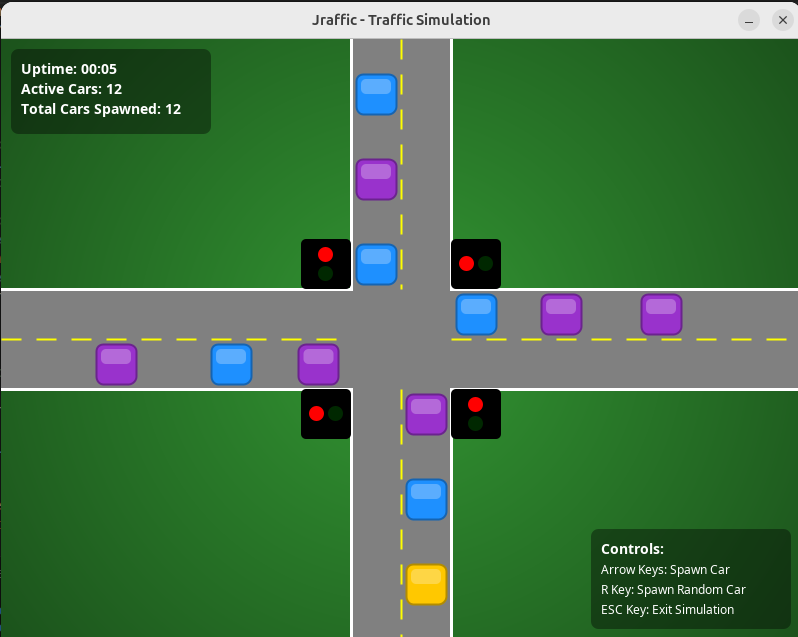

# Jraffic: A Java Swing Traffic Simulation

Jraffic is a dynamic and visually appealing 2D traffic simulation built entirely in Java Swing. It models a four-way intersection with intelligent, density-based traffic lights and realistic vehicle behavior, including collision avoidance and proper lane discipline for turns. The application is written in a single file with zero external dependencies, allowing it to run on any standard Java installation.




---

## Features

*   **Dynamic Traffic Simulation:** Watch as cars navigate a busy intersection, adhering to traffic laws and avoiding collisions.
*   **Intelligent Traffic Lights:** The duration of a green light is dynamically calculated based on the number of waiting cars, optimizing traffic flow.
*   **Realistic Vehicle Behavior:** Cars correctly stop for red lights, avoid rear-ending vehicles in front of them, and execute turns into the proper lanes.
*   **Interactive Controls:** Manually spawn cars from any direction to test specific scenarios, or spawn cars randomly to simulate a busy intersection.
*   **Polished User Interface:** A modern UI featuring anti-aliased graphics, stylized vehicles, a vignette background, and on-screen displays for statistics and controls.
*   **Zero Dependencies:** The entire application is self-contained in a single Java file and uses only the standard Java Swing library. No setup or external libraries are required.

---

## Getting Started

To run the Jraffic simulation, you only need a Java Development Kit (JDK) version 8 or newer installed on your system.

### Compilation & Execution

1.  Save the source code as `Jraffic.java`.
2.  Open a terminal or command prompt and navigate to the directory where you saved the file.
3.  Compile the code with the following command:
    ```bash
    javac JrafficSwing.java
    ```
4.  Run the compiled application with this command:
    ```bash
    java JrafficSwing
    ```
    A new window displaying the simulation should appear.

---

## Controls

The simulation can be controlled using the following keyboard commands:

| Key                | Action                               |
| ------------------ | ------------------------------------ |
| **Arrow Keys**     | Spawn a car from a specific direction. |
| **R Key**          | Spawn a car from a random direction.   |
| **ESC Key**        | Exit the simulation.                 |